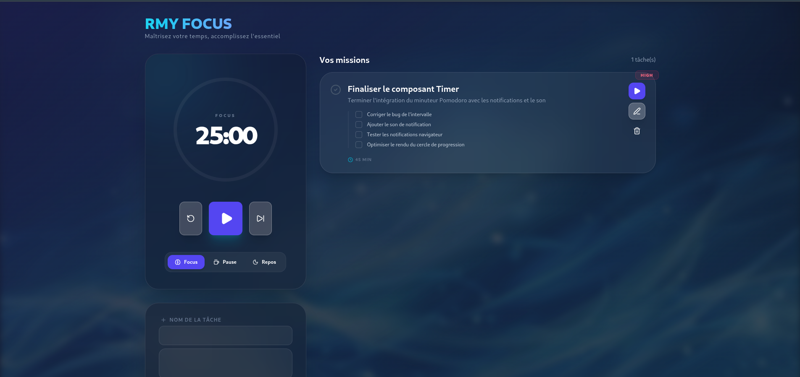

<div align="center">
  
  
  
  
</div>

<br />

<div align="center">
  <h1>⏳ RMY FOCUS</h1>
  <p><em>Maîtrisez votre temps, accomplissez l'essentiel.</em></p>
</div>

---

## 🎯 À propos

**RMY FOCUS** est une application web moderne de gestion de tâches combinée à la technique **Pomodoro**.  
Conçue pour les développeurs, étudiants et créatifs qui veulent rester concentrés et productifs.

> 🧠 *"La productivité n'est pas une question de temps, mais de focus."*

---

## ✨ Fonctionnalités

| 🕐 | 🗂️ | 🔔 |
|---|---|---|
| **Minuteur Pomodoro** 25/5/15 min personnalisable | **Gestion de tâches** avec priorités Low/Medium/High | **Notifications navigateur** en fin de cycle |
| **Sous-étapes** pour découper vos missions | **Persistance locale** via localStorage | **Interface glassmorphism** moderne et fluide |
| **Mode focus** sur une tâche active | **Édition rapide** avec drawer coulissant | **Déploiement automatique** CI/CD |

---

## 🛠️ Stack technique

```json
{
  "frontend": "React 19 + Vite",
  "styling": "Tailwind CSS 4",
  "animations": "Framer Motion",
  "icônes": "Lucide React",
  "state": "useLocalStorage (hook personnalisé)",
  "déploiement": "GitHub Pages + GitHub Actions"
}
```

---

## 🚀 Démarrage rapide

### Prérequis
- **Node.js** ≥ 18
- **npm** ≥ 9

### Installation

```bash
# Cloner le repo
git clone https://github.com/razafimanantsoaamarah-droid/Promodoro-to-do.git
cd Promodoro-to-do/frontend

# Installer les dépendances
npm install

# Lancer en développement
npm run dev
```

L'application est accessible sur `http://localhost:5173`.

### Build production

```bash
npm run build
npm run preview
```
---

## 🔄 CI/CD

À chaque push sur `main`, GitHub Actions :
1. Installe les dépendances
2. Build le projet
3. Déploie sur **GitHub Pages**

[](https://github.com/razafimanantsoaamarah-droid/Promodoro-to-do/actions)

---

## 🔮 Roadmap

- [x] Minuteur Pomodoro (Focus / Short Break / Long Break)
- [x] CRUD Tâches avec sous-étapes
- [x] Notifications navigateur
- [x] Son de fin de cycle
- [x] Interface Glassmorphism
- [x] Persistance localStorage
- [x] CI/CD GitHub Actions
- [ ] Mode sombre/clair
- [ ] Statistiques de productivité
- [ ] Export des tâches (JSON/CSV)
- [ ] Synchronisation cloud (Firebase)
- [ ] PWA complète (offline)

---

## 🤝 Contribuer

Les contributions sont les bienvenues !

1. **Fork** le projet
2. Crée une branche : `git checkout -b feature/ma-feature`
3. Commit : `git commit -m 'feat: ma feature'`
4. Push : `git push origin feature/ma-feature`
5. Ouvre une **Pull Request**

---

## 📄 Licence

MIT © [RMY FOCUS Team](https://github.com/razafimanantsoaamarah-droid)

---

<div align="center">
  <sub>Made with ❤️ and ☕ by <strong>RMY FOCUS Team</strong></sub>
</div>