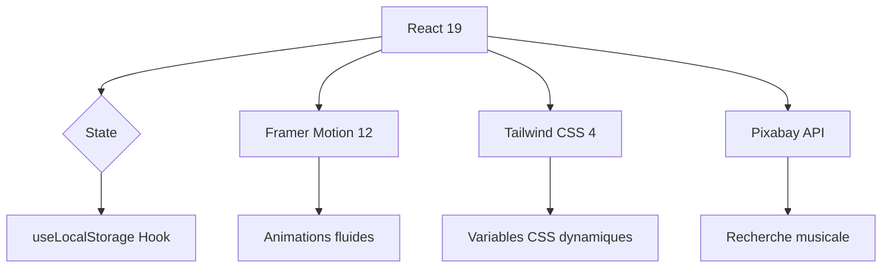

<div align="center">
<h1>
  
</h1>

<br />

[](https://github.com/razafimanantsoaamarah-droid/Promodoro-to-do/releases)
[](https://react.dev)
[](https://vitejs.dev)
[](https://opensource.org/licenses/MIT)
[](https://github.com/razafimanantsoaamarah-droid/Promodoro-to-do/actions)

<h3><em>"Maîtrisez votre temps, accomplissez l'essentiel."</em></h3>

</div>

---

## 💎 Aperçu 

<div align="center">
  
</div>

---

## ⚡ Fonctionnalités

| 🎨 Design System | ⏱️ Moteur Pomodoro | 🎵 Ambiance Sonore |
| :--- | :--- | :--- |
| **Interface Glassmorphism** | **Cycles intelligents** | **Recherche Pixabay intégrée** |
| 5 thèmes dynamiques | Focus (25 min) / Pause (5 min) / Repos (15 min) | Lecture en continu avec playlist |
| Upload d'images personnalisées | Persistance via localStorage | Contrôle volume, mute, piste suivante |

| 📋 Gestion de Tâches | 🔔 Notifications | 🚀 Performance |
| :--- | :--- | :--- |
| **CRUD complet** | **Alertes navigateur natives** | **React 19 + Vite 8** |
| Sous-étapes & Priorités (Low/Medium/High) | Toasts animés contextuels | Tailwind CSS 4 |
| Drawer d'édition coulissant | Son de fin de cycle | Zéro backend - 100% client |

---

## 🎠 Galerie des Thèmes

<details open>
<summary><b>▶ Cliquez pour voir les ambiances disponibles</b></summary>
<br />
<div align="center">
  <table>
    <tr>
      <td align="center">
        <br/>
        <b>🌌 RMY Dark</b>
      </td>
      <td align="center">
        <br/>
        <b>🤖 Cyberpunk</b>
      </td>
    </tr>
    <tr>
      <td align="center" colspan="2">
        <i>🔄 Utilisez le menu Paramètres (⚙️) pour changer d'ambiance en un clic !</i>
      </td>
    </tr>
  </table>
</div>
</details>

---

## 🛠️ Stack Technique



| Technologie | Usage |
|-------------|-------|
| **React 19** | UI Components & Hooks |
| **Vite 8** | Build tool ultra-rapide |
| **Tailwind CSS 4** | Utility-first styling |
| **Framer Motion 12** | Animations & transitions |
| **Lucide React** | Icônes vectorielles |
| **Pixabay API** | Recherche de musique libre de droit |

---

## 🚀 Installation Express

```bash
# 1. Cloner le repo
git clone https://github.com/razafimanantsoaamarah-droid/Promodoro-to-do.git

# 2. Aller dans le dossier frontend
cd Promodoro-to-do/frontend

# 3. Installer les dépendances
npm install

# 4. Lancer en développement
npm run dev
```

> [!TIP]
> Pour débloquer la recherche musicale, créez un fichier `.env` dans `frontend/` avec votre clé API Pixabay :
> ```
> VITE_PIXABAY_API_KEY=votre_clé_api
> ```
> Obtenez-la gratuitement sur [pixabay.com/api/docs](https://pixabay.com/api/docs/) 🎶

---

## 🔮 Roadmap 2026

- [x] **Phase 1 :** Core Pomodoro & CRUD Tâches
- [x] **Phase 2 :** Thèmes dynamiques & Lecteur musical
- [ ] **Phase 3 :** Authentification & Synchronisation cloud
- [ ] **Phase 4 :** Dashboard de productivité & Statistiques
- [ ] **Phase 5 :** PWA complète (mode hors-ligne)

---

## 📝 Changelog

| Version | Date | Nouveautés |
|---------|------|------------|
| **v1.1.0** | Avril 2026 | Thèmes dynamiques, lecteur musical, SettingsPanel |
| **v1.0.1** | Avril 2026 | Composants UI réutilisables, refonte glassmorphism |
| **v1.0.0** | Mars 2026 | Version initiale (Pomodoro + CRUD) |

---

<div align="center">
  
  <br />
  <sub>© 2026 <b>RMY FOCUS Team</b> - Tous droits réservés.</sub>
</div>
